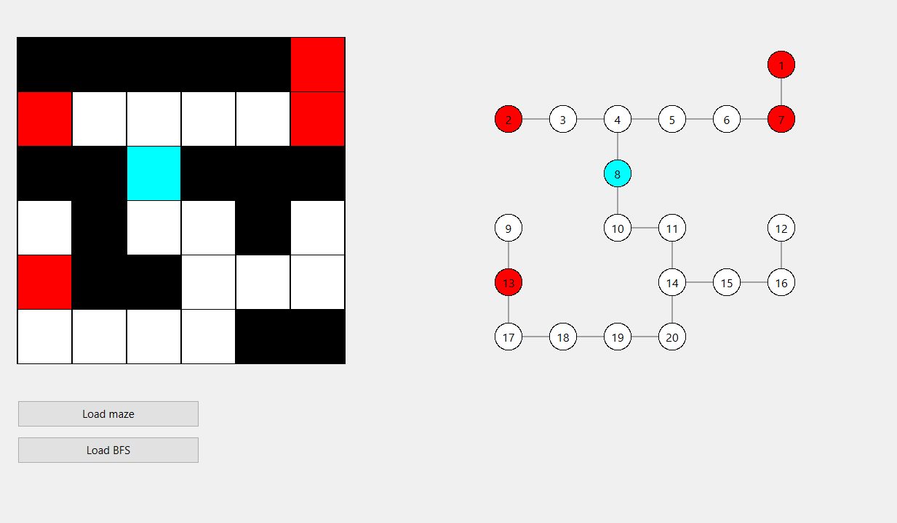
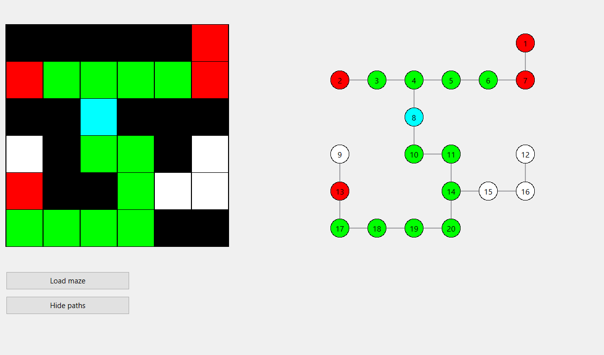

# Maze Solver using BFS (Qt & C++)

This project is a maze visualization and solving application that uses the Breadth-First Search (BFS) algorithm to compute the shortest paths from a start position to all exits in a maze.

The application is implemented in C++ using the Qt framework and provides both a maze view and a graph-based representation.

---

## Features

- Load a maze from a text file
- Parse the maze into a matrix representation
- Build a graph from walkable maze cells
- Execute the Breadth-First Search algorithm
- Display shortest paths to all exits
- Toggle path visibility
- Visualize both the maze and its corresponding graph

---

## Maze Format

The maze is read from a text file and uses the following encoding:

| Value | Meaning |
|------:|---------|
| 0 | Wall |
| 1 | Free path |
| 2 | Exit |
| 3 | Start position |

Only digits between 0 and 3 are considered; any other characters are ignored.

---

## User Interface

### Controls
- Load maze: Loads a maze from a text file
- Load BFS: Executes BFS and displays the shortest paths
- Hide paths: Clears the displayed paths

### Color Coding
- Black: Wall
- White: Free path
- Cyan: Start position
- Red: Exit
- Green: BFS path

---

## Implementation Details

### Graph Construction
- Each non-wall cell is treated as a graph node
- Edges are created between adjacent cells (up, down, left, right)
- The start node and exits are identified during graph construction

### BFS Algorithm
- Uses a queue-based implementation
- Maintains parent relationships for path reconstruction
- Computes the shortest distance from the start node to all reachable nodes

### Visualization
- The maze is drawn as a grid of cells
- The graph is drawn using nodes and edges aligned with maze coordinates
- Each node is labeled with an index for clarity

---

## Technologies Used

- C++
- Qt Framework

---
## Screenshots

---

Developed as part of an academic assignment for graph algorithms.

